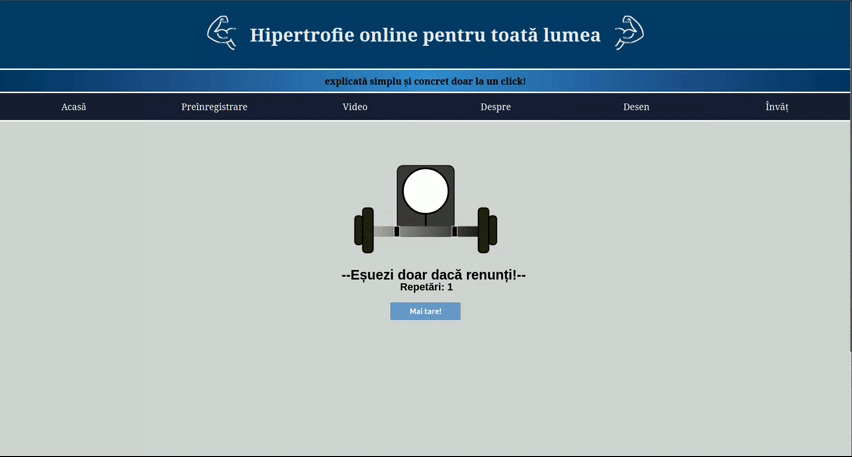

# Hypertrophy Online - Romanian Muscle Building Website

Educational fitness website in Romanian language featuring exercise demonstrations, workout planning tools, and hypertrophy training information. 
## About

An interactive fitness website built with HTML5, CSS3, JavaScript, and Python. Features dynamic content loading via AJAX, allowing seamless navigation without page refreshes. Includes exercise video galleries, SVG animations with rep counters, interactive Canvas drawing tools, and form validation. The custom Python server handles HTTP requests and serves static content. Built as an academic project for my university web programming course demonstrating web development techniques.


## Preview
<p align="center">
  
</p>
<p align="center"><i>Homepage</i></p>
</br> </br>

<p align="center">
  
</p>
<p align="center"><i>Bench Press animation with <i> <b> motivation </b></i> button</i></p>

</br> </br>

<p align="center">
  
</p>
<p align="center">Exercise video gallery </p>

</br> </br>
<p align="center">and more..</p>

## How to Run

### Prerequisites
- Python 3.x installed
- Modern web browser (Chrome, Firefox, Edge, Safari)

### Install && run
Open Windows PowerShell or the Linux Terminal and run the following commands:
1. **Clone the repository:**
   
```bash
git clone https://github.com/robeery/ro-hyperthrophy-website.git
```


2. **Open the server folder:**
```bash
cd ro-hyperthrophy-website/server_web
```

3. **Run the start server script:**
   
<b>Windows</b>
```bash
./lanseaza_server.bat
```
Or just double click the lanseaza_server.bat file.
</br>

<b> Linux/MacOS </b>

Make the script file executable:
```bash
chmod +x lanseaza_server.sh
```
Afterwards, just run:
```bash
./lanseaza_server.sh
```
<b> Alternatively </b>, especially if you don't have git installed, you may download the repository as a zip, unarchive it, navigate to the server_web folder and do step 3.

## Troubleshooting
- If port 5678 is already in use, modify the port in `server_web.py`
- Ensure Python 3.x is in your system PATH
- To stop the server, press Ctrl + C in the terminal window


